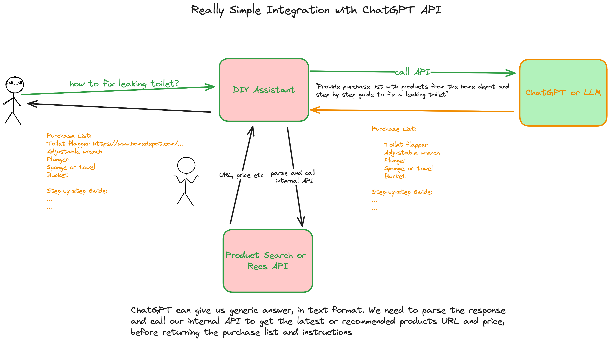
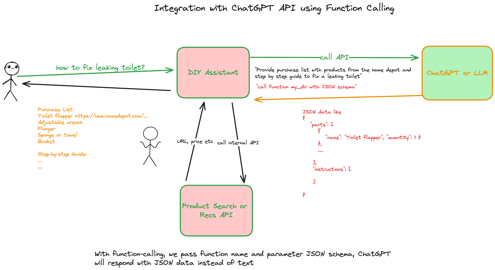

# ChatGPT Examles

In this example, we create a DIY assitant. For example, user can ask "how to fix a leaking toilet?", and we will first ask ChatGPT to get the purchase list and step by step instructions. Then, we call our own internal API to get the recommended products (with URL, price etc).

## Run

````
python3 -m venv myenv
source myvenv/bin/activate
pip install -r requirements.txt
export OPENAI_API_KEY=....
flask run
````

visit http://localhost:5000/

## How It Works

We send prompts to ChatGPT with function name (the name does not matter ...) and JSON schema. ChatGPT will return "function_call" in response, and JSON data, then we use the structured data to do further processing for example call our internal API to get more attributes.

````
{
  "role": "assistant",
  "content": null,
  "function_call": {
    "name": "post_chatgpt_process",
    "arguments": "{\n  \"parts\": [\n    {\n      \"name\": \"Toilet Flapper\",\n      \"amount\": 1\n    },\n    {\n      \"name\": \"Adjustable Wrench\",\n      \"amount\": 1\n    },\n    {\n      \"name\": \"Sponge\",\n      \"amount\": 1\n    },\n    {\n      \"name\": \"Bucket\",\n      \"amount\": 1\n    },\n    {\n      \"name\": \"Towels\",\n      \"amount\": 2\n    }\n  ],\n  \"instructions\": [\n    \"Turn off the water supply to the toilet.\",\n    \"Flush the toilet to drain the water from the tank.\",\n    \"Use a sponge or towels to soak up any remaining water in the tank.\",\n    \"Remove the old flapper from the overflow tube and chain from the lever.\",\n    \"Attach the new flapper to the overflow tube and connect the chain to the lever.\",\n    \"Turn the water supply back on and let the tank fill with water.\",\n    \"Flush the toilet to make sure the new flapper is working properly and there are no leaks.\"\n  ]\n}"
  }
}
````

## Function Calling

Without function calling, we need to parse the text message from ChatGPT and call our internal API



With function calling, we can pass the JSON schema and have ChatGPT to return structured data

